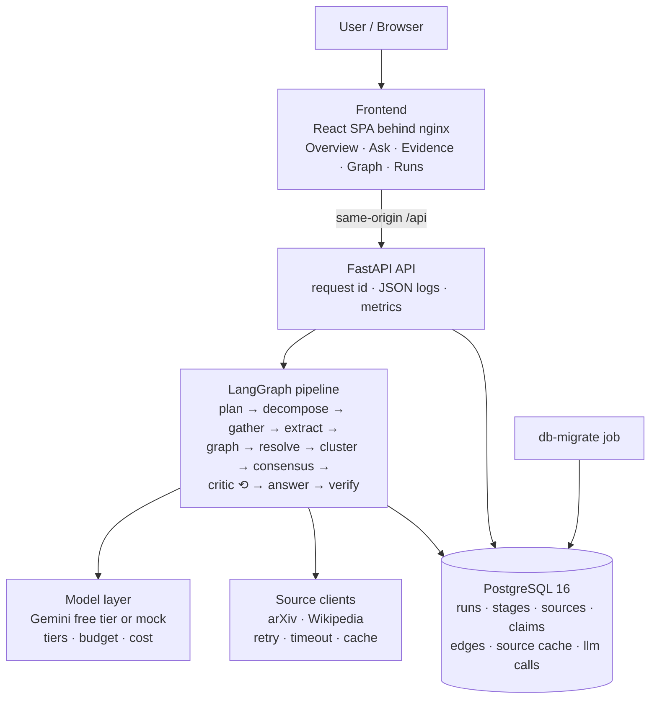

# Architecture

This document describes the target architecture and marks what is
**implemented** today versus **designed** for later phases. The phase plan and
acceptance criteria are in `specification.md`; the reasoning behind individual
choices is in `decisions/`.

## Logical view



## Implementation status

| Component | Status | Where |
|-----------|--------|-------|
| Docker Compose environment, ordered startup (postgres → db-migrate → backend → frontend) | **Implemented** (Phase 1) | `docker-compose.yml` |
| PostgreSQL 16, forward-only idempotent migrations, core schema for runs and evidence | **Implemented** (Phase 1) | `database/` |
| FastAPI service: `/health`, `/ready`, `/api/v1/system/status`, `/metrics` | **Implemented** (Phase 1) | `backend/app/` |
| Request ids end to end, JSON logs, Prometheus HTTP metrics, JSON 500 envelope | **Implemented** (Phase 1) | `backend/app/observability/` |
| React SPA shell with Overview page (readiness, system status) | **Implemented** (Phase 1) | `frontend/src/` |
| CI: lint, unit tests, frontend build, full-stack smoke test, image builds | **Implemented** (Phase 1) | `.github/workflows/` |
| Source clients (arXiv, Wikipedia): typed results, retries, per-host throttle, database-backed search cache, per-source failure isolation, `/api/v1/sources/search` | **Implemented** (Phase 2) | `backend/app/sources/`, `docs/evidence.md` |
| Model layer: `LLMProvider` with Gemini and deterministic mock, JSON-schema output, tier fallback, daily request budget, price table, usage ledger | **Implemented** (Phase 2) | `backend/app/llm/`, ADR-004 |
| Claim extraction with stance, deterministic ids, dedup and caps; manual CLI check | **Implemented** (Phase 2) | `backend/app/evidence/`, ADR-005 |
| Retry policy with jittered backoff (shared by sources and model layer) | **Implemented** (Phase 2) | `backend/app/reliability/retry.py` |
| Citation graph with real `refutes` edges, conflict detection and resolution | Designed (Phase 3) | `backend/app/graph/`, `backend/app/reasoning/` |
| LangGraph pipeline, critic loop, verified answer, run persistence and API | Designed (Phase 4) | `backend/app/pipeline/` |
| Ask, Evidence, Graph and Runs pages | Designed (Phase 5) | `frontend/src/pages/` |
| Pipeline metrics, retries with jitter, circuit breakers, run deadline, rate limit | Designed (Phase 6) | `backend/app/reliability/` |
| Benchmark with deterministic graders and committed reports | Designed (Phase 7) | `backend/app/evaluation/`, `evaluation/reports/` |
| Security review, final docs, publication | Designed (Phase 8) | — |

## Runtime view (Phase 1)

```mermaid
sequenceDiagram
    participant D as docker compose up
    participant PG as postgres
    participant M as db-migrate
    participant B as backend
    participant F as frontend
    D->>PG: start (postgres:16-alpine, empty or existing volume)
    PG-->>D: healthy (pg_isready)
    D->>M: start (depends_on: postgres healthy)
    M->>PG: CREATE schema_migrations IF NOT EXISTS; apply pending migrations/*.sql
    M-->>D: exit 0 ("applied 0001_core" or "nothing to apply")
    D->>B: start (depends_on: db-migrate completed_successfully)
    B-->>D: healthy (GET /health)
    D->>F: start
    F->>B: /ready, /api/v1/system/status (proxied by nginx)
```

## Services

| Service | Image | Port (host) | Purpose |
|---------|-------|-------------|---------|
| `postgres` | `postgres:16-alpine` | `127.0.0.1:5433` | Runs, evidence, graph edges, caches |
| `db-migrate` | `./database` (Python 3.12) | — | One-shot forward-only migrations |
| `backend` | `./backend` (Python 3.12, FastAPI, uvicorn) | `8100` | API and pipeline |
| `frontend` | `./frontend` (Node build → nginx) | `3100` | UI + reverse proxy to backend |

Ports differ from the copilot's (3000/8000/5432) so both stacks can run side by side.

## Key design rules

- **Configuration by environment only.** `backend/app/config.py` reads
  environment variables with safe local defaults; secrets are `SecretStr` and
  never appear in logs or `repr`.
- **Deterministic identifiers.** Source ids are the arXiv id or a stable hash
  of the canonical URL; claim ids are `{source_id}#{n}`. No Python `hash()`.
- **Stance is first class.** Every claim records whether it supports, refutes
  or is neutral to its sub-question, so the graph contains real disagreement.
- **Structured output or a recorded error.** Model output is validated by
  Pydantic; failures become stage errors, never silent fallbacks.
- **Every run is persisted** with stages, sources, claims, edges, tokens, cost
  and latency, and is retrievable by id.
- **Same artefacts everywhere.** The images Compose builds are the images that
  run on any Docker host.

## Repository layout

```
ArguMind/
├── backend/            FastAPI service (app/, tests/, Dockerfile)
│   └── app/            api/, llm/, sources/, evidence/, reliability/, observability/
├── database/           migrate.py, migrations/, tests/, Dockerfile
├── frontend/           Vite + React SPA, nginx.conf, Dockerfile
├── docs/               specification, architecture, evidence, ADRs
├── .github/workflows/  test.yml, build.yml
├── docker-compose.yml  canonical local environment
├── Makefile            convenience targets (all run inside Docker)
└── .env.example        every configurable value with a safe default
```

Directories for sources, the model layer, the graph, the pipeline, reliability
and evaluation are created in the phase that implements them rather than as
empty placeholders.
